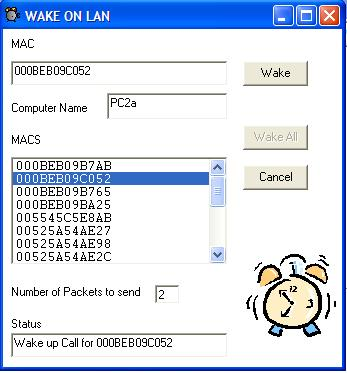



## wake on lan, WOL

### Description

Wake On LAN functionality for the computers on your LAN.
 
### More Info
 
Mac Addresses and the computer names are in the MACS.TXT. "Mac:Computer Name" per line.

             |
---                |---
**Submitted On**   |2007-07-28 13:45:26
**By**             |[Gurel Vural](https://github.com/Planet-Source-Code/PSCIndex/blob/master/ByAuthor/gurel-vural.md)
**Level**          |Beginner
**User Rating**    |5.0 (20 globes from 4 users)
**Compatibility**  |VB 6\.0
**Category**       |[Complete Applications](https://github.com/Planet-Source-Code/PSCIndex/blob/master/ByCategory/complete-applications__1-27.md)
**World**          |[Visual Basic](https://github.com/Planet-Source-Code/PSCIndex/blob/master/ByWorld/visual-basic.md)
**Archive File**   |[wake\_on\_la2077427292007\.zip](https://github.com/Planet-Source-Code/gurel-vural-wake-on-lan-wol__1-69071/archive/master.zip)

